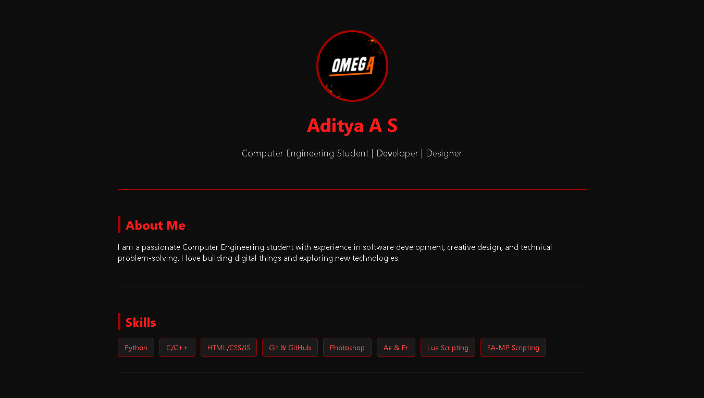

# 🔥 Personal Portfolio Website - Aditya A S

This is my personal portfolio website built with HTML and CSS. It represents me as a Computer Engineering student, developer, and graphics designer — all in a clean black and red theme.

 <!-- Optional: Replace with actual screenshot of your site -->

---

## 🚀 Features

- ⚙️ Fully static HTML/CSS (no framework)
- 🖤 Clean black theme with red accent
- 👨‍💻 About Me, Skills, Projects, Contact sections
- 📱 Responsive layout (basic)
- 🌐 Easily hosted on GitHub Pages, Netlify, or localhost

---

## 📂 Project Structure

